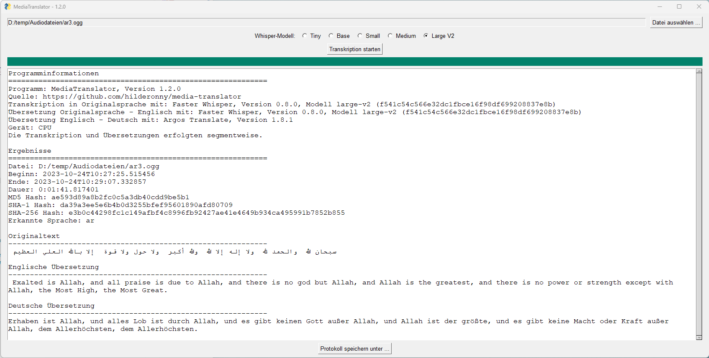
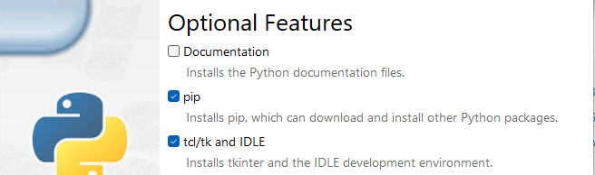
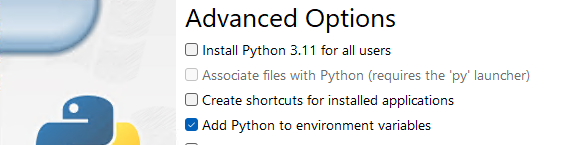

# media-translator

Mit diesem Tool kann man Audio- und Videodateien unter Windows transkribieren und den Text ins Deutsche übersetzen.



[Download](https://github.com/hilderonny/media-translator/releases)

[](https://github.com/hilderonny/media-translator/actions/workflows/PyInstaller.yml)

## Benutzung

Einfach die neueste ZIP-Datei von [hier](https://github.com/hilderonny/media-translator/releases) herunterladen, entpacken und die Datei **MediaTranslator.exe** ausführen. Das Programm ebnötigt keine Installation.

**Achtung:** Beim ersten Programmstart sowie beim Auswählen der Whisper-Modelle müssen ggf. KI-Modelle aus dem Internet geladen werden (bis zu 3 GB). Bei allen weiteren Ausführungen ist keine Internetverbindung mehr notwendig. Die KI-Modelle werdenn dann aus dem Unterverzeichnis `data` geladen. Für eine vollständige Offline-Version führen Sie am Besten testhalber kurze Transkriptionen mit jedem Modell bei bestehender Internetverbindung durch.

Wenn das Programm läuft, wählt man eine Datei und ein Whisper-Modell aus (Small sollte für den Anfang ganz gut sein) und startet die Transkription.

Je nach Länge der Audiodatei kann die Transkription eine Weile dauern. Für 1 Minute Audio kann mit etwa 2 Minuten Verarbeitungszeit gerechnet werden.

Nach Abschluss wird im Anwendungsfenster ein Protokoll der Transkription angezeigt, welches in einer Textdatei gespeichert werden kann.

## Einrichtung der Entwicklungsumgebung

Zuerst muss Python mit der Version 3.11.6 (neuere Versionen haben ein Problem mit der Installation von faster-whisper) mit der Erweiterung "TCL/TK" installiert werden. https://www.python.org/downloads/windows/




Die grafische Oberfläche benutzt [PySimpleGUI](https://www.pysimplegui.org/) und wir per `pip` installiert.

```
pip install pysimplegui
```

Die Transkription und Übersetzung ins Englische erfolgt über [Faster Whisper](https://github.com/guillaumekln/faster-whisper).

```
pip install faster-whisper
```

**Faster Whisper benutzt intern CTranslate2. Dieses wiederum benötigt die [Visual C++ Redistributable for Visual Studio 2015](https://www.microsoft.com/en-US/download/details.aspx?id=48145), welche vor dem ersten Start installiert werden muss.**

Für die Übersetzung von Englisch nach Deutsch wird [Argos Translate](https://github.com/argosopentech/argos-translate) benutzt.

```
pip install argostranslate
```

Das Kompilieren in eine ausführbare EXE-Datei erfolgt mit [PyInstaller](https://pyinstaller.org/en/stable/).

```
pip install pyinstaller
```

## EXE-Datei kompilieren

Das Programm kann auch ohne vorhandene KI-Modelle kompiliert werden.

```
pyinstaller -w MediaTranslator.pyw
```

Dabei wird ein Verzeichnis `dist/MediaTranslator` erstellt, in dem die EXE-Datei abgelegt wird. Diese Datei ist dann portabel ausführbar, sofern alle anderen Dateien und Unterverzeichnisse vorhanden sind.

In dieses Verzeichnis muss auch das `data` Verzeichnis mit den KI-Modellen kopiert werden, also nach `dist/data`.

## KI Modelle herunterladen

Die KI-Modelle für Faster Whisper müssen sich im Unterverzeichnis `./data/faster-whisper` befinden, die für Argos Translate in `./data/argos-translate`.

Faster Whisper lädt automatisch fehelnde Modelle herunter, sobald das Programm ausgeführt wird und auf das entsprechende Modell zugreifen möchte.

Für Argos Translate müssen die Modelle vorab geladen werden:

```
python ./download_argos_models.py
```

## Metadaten für Protokoll aktualisieren

Damit im Protokoll stets die korrekten Versionsinformationen enthalten sind, müssen diese in `MediaTranslator.pyw` im Objekt `METADATA` gepflegt werden.

1. **PROGRAM_VERSION** : Das ist die Versionsnummer des Programms selbst. Diese muss vor jeder Kompilierung bzw. vor jedem Release hochgesetzt werden.
2. **FASTER_WHISPER_MODEL_####_VERSION** : Snapshot-ID des jeweiligen Modells. Ergibt sich aus dem Verzeichnisnamen unterhalb `snapshots`, in dem das Modell abgespeichert ist. Muss manuell geändert werden, sobald ein Modell heruntergeladen oder aktualisiert wird.